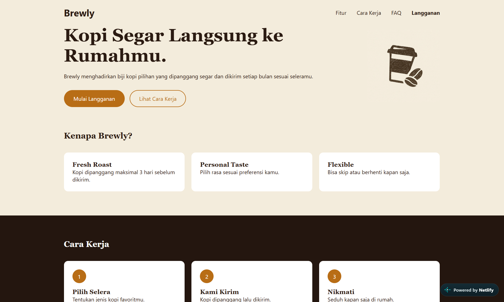
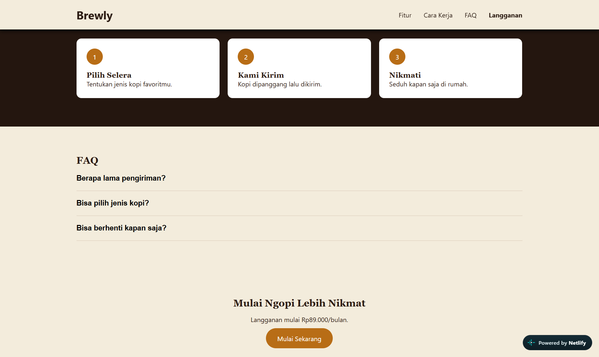
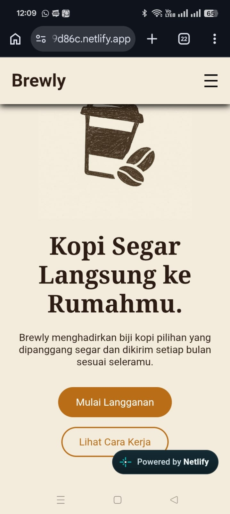
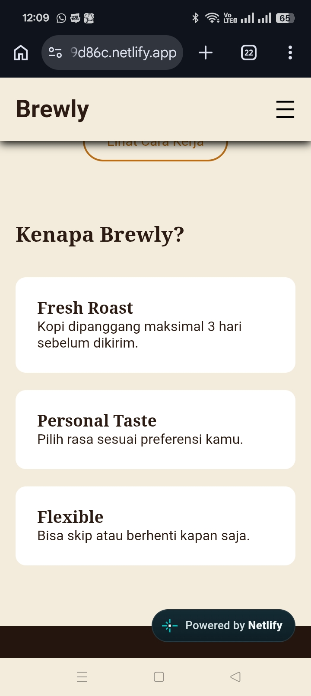
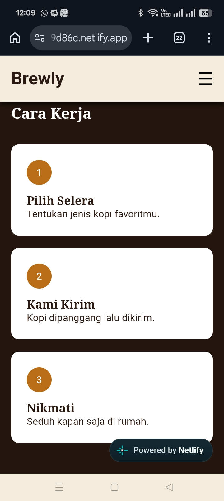
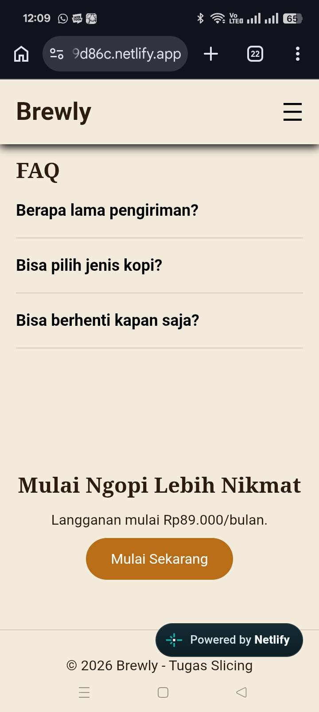

# Brewly Landing Page

Brewly adalah website landing page bertema coffee shop yang dibuat sebagai tugas slicing website menggunakan HTML, CSS, dan JavaScript tanpa framework.

## Fitur

- Responsive (Mobile & Desktop)
- Sticky Navbar
- Hamburger Menu
- FAQ Accordion
- Smooth Scroll

## Screenshot

### Desktop

### Mobile

## Deployment

- **GitHub Repository:** [Brewly Landing Page](https://github.com/felixsanders086-tech/Brewly-Landing-Page)
- **Netlify:** [playful-scone-b9d86c.netlify.app](https://playful-scone-b9d86c.netlify.app)